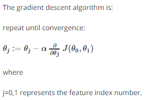

# www.coursera.org/learn/machine-learning/

## week 1

### 监控学习

- 回归问题
- 分类问题 （离散值）

### 非监督学习

- 聚类
- 非聚类

### model and cost function

- 假设函数 (hypothesis function) `h θ(xi)`
- 代价函数 (cost function)
- 平方误差代价函数，解决线性回归问题 `J(θ,θ1)`

最小化代价函数 `min J(θ,θ1)`

### 梯度下降

最小化代价函数的机器学习算法

用于最小化`J(θ,θ1,θ2,...,θn)`

其中 α 是学习速率

需要同时更新`θ,θ1,θ2,...,θn`
